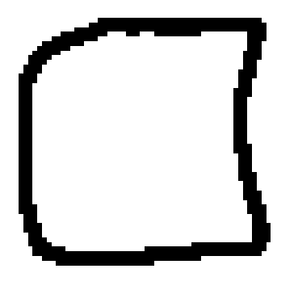
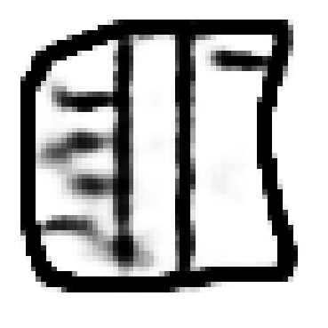

# Variational Encoder for Handwritten Image Reconstruction
This project Conditional Variational Autoencoders (CVAE) to reconstruct and complete handwritten drawings from the QuickDraw dataset.

## Table of Contents

1. Analysis
2. Installation, Training & Running
3. Project Structure
4. Results/Examples

## Analysis
You can find the analysis of the our model in [analysis.pdf](analysis.pdf).\
**Note:** this document is only available in Croatian language.

## Installation, Training & Running

1. Download Dataset: Use the `./quickdraw/download.sh` shell script to fetch the QuickDraw .ndjson files.
Currently, the script is configured for a single category to streamline initial training, but any number of other categories can be fetched for training if so desired.
2. Environment Setup: `pip install -r requirements.txt`
3. Entry Points: Run `python -m scripts.train_cvae` to train the model.
To change the hyperparameters, open the `scripts/train_cvae` file itself and modify there in-place.
The resulting weights will be saved in checkpoints in the `checkpoints` directory, from there move
desired checkpoint to `weights` and run `python -m ui` run a QT-based UI for custom input reconstruction.

## Project Structure
| Path            | Description                                                                    |
|-----------------|--------------------------------------------------------------------------------|
| data/           | Dataset classes and preprocessing utilities                                    |
| images/         | Demonstrative image examples produced by our model                             |
| models/         | CVAE model implementations                                                     |
| models/scripts/ | Training entry points                                                          |
| notebooks/      | Experimental Jupyter notebooks                                                 |
| quickdraw/      | Data download scripts                                                          |
| analysis.pdf    | Analysis of the model written as a paper. Available in Croatian language only. |
| ui.py           | Used for interactive inspection of the trained model                           |

### 1. Data (`/data`)

- **dataset.py**  
Contains implementations of torch dataset and dataloader class for vae models.
Dataloader returns data in this order: (partial image, full image, label).
It also applies image erosion to thicken the strokes of the drawings, making them easier for the CNN to process.

- **loader.py**  
Used by the UI script to load and sample models.

- **utils.py**  
Contains helper functions to transform sequential stroke data from the QuickDraw format into 2D image tensors based on the image_shape parameter.

### 2. Images (`/images`)
Contains images produced by our model created for demonstration.
The images are sorted into directories by class.
Since input images are from the test set, each sample contains:
- **ground truth** - the complete reference image from which the partial image was created
- **partial image** - input to the model
- **reconstructed image** - output of the mode
- **binarized image** - binarized output of the model

### 2. Models (`/models`)

Contains out conditional and classical VAE implementation.

- <b>cvae_model.py</b>: A Conditional VAE implementation using two encoders and one decoder.

   Encoder Prior: Models `p(z∣y)` (latent space based on partial image).

   Encoder Posterior: Models `p(z∣y,x)` (latent space based on partial and full image).

   Decoder: Models `p(x∣z,y)` (reconstruction based on latent vector and partial image).

   Architecture: Encoders feature 4 Convolutional layers followed by a Linear layer. The Decoder uses 4 ConvTranspose layers for upsampling.

- **cvae_model_decoderz.py**: A modified CVAE where the decoder only receives the latent vector z, omitting the partial image y. \\
Note: This is done because its been noted that model can overfit to partial image instead of trying to reconstruct it.

### 3. Train (`/models/scripts`)
Contains the scripts used for training and evaluating the model.

- **train_cvae.py**  
Can be used to train both `cvae_model.py` and `cvae_model_decoderz.py`, only thing you need to do is modify imports.\
During training canvas visualizes training.\
At the end of training validation and train losses are shown.\
Model is saved on `KeyboardInterrupt` and it can save checkpoints.
\
You can configure the following hyperparameters within the scripts:
   1. learning rate using `lr`
   2. latent dimension using `latent_dim`
   3. binarization threshold for vizualization
   4. image_limit which says how many images will be used in training
   5. image_size which is used as parameter to dataset class

Keep in mind that for now X and y variables from dataloaders are switched in naming convention.

### 4. Notebooks (`\notebooks`)
Interactive notebooks used for testing and training.

### 6. Quickdraw
Contains the script for downloading the dataset and serves as the container for the dataset itself.

## Results/Examples
Example reconstruction for some of the classes:
| Partial input | Reconstruction | Binarized reconstruction |
| :---: | :---: | :---: |
|    (a) Partial book |    (b) Reconstructed book |    (c) Binarizirana book |
|    (d) Partial ice cream |    (e) Reconstructed ice cream |    (f) Binarized ice cream |
|    (g) Partial smiley |    (h) Reconstructed smiley |    (i) Binarized smiley |

Example of multiple different ice cream reconstructions from the same input image (cone):

You can view more examples in the `images` directory.

